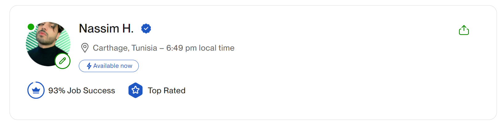

# Machine Learning & Deep Learning| Data Analysis & Visualization | Computer Vision & Image Processing

Hello! 😊 I'm Nassim, a Machine Learning Engineer with 3 years of experience, graduated with honors from 𝘌𝘤𝘰𝘭𝘦 𝘗𝘰𝘭𝘺𝘵𝘦𝘤𝘩𝘯𝘪𝘲𝘶𝘦 𝘥𝘦 𝘛𝘶𝘯𝘪𝘴𝘪𝘦 a leading engineering university in Tunisia.

<h3> Portfolio 💼 </h3>

<table>
<tr>  
    <th> ɢɪᴛʜᴜʙ ʀᴇᴘᴏꜱɪᴛᴏʀʏ </th> 
    <th> ᴀʀᴇᴀ | ꜰɪᴇʟᴅ🧩</th>  
    <th> ᴘʀᴏᴊᴇᴄᴛ ᴏᴠᴇʀᴠɪᴇᴡ ✎ </th>  
    <th>𝕸𝖊𝖉𝖎𝖚𝖒 𝕾𝖙𝖔𝖗𝖞✍  </th>  
    <th>ʏᴏᴜᴛᴜʙᴇ ᴠɪᴅᴇᴏ  </th>  
    <th>ᴏᴛʜᴇʀ</th>  
</tr>
  
<tr>
        <td> <a href="https://github.com/Nassimos07/Moving-Stopped-Persons-Real-Time-Detection-using-YOLOv8-or-YOLOv10-Roboflow_Supervision"> 🚀 Moving Stopped Persons Real Time Detection </a></td>
        <td> Computer Vision (Object Tracking)</td>
        <td>The purpose of this solution is to deliver a real-time or post-event tool capable of accurately detecting, visualizing, and distinguishing between moving and stationary individuals. This project holds 
        significant potential as a security solution.</td>
        <td><a href="https://medium.com/@nassim.hammami98/moving-stopped-persons-detection-using-yolov8-yolov10-supervison-126bffaec954"> Medium Story </a></td>
        <td><a href="https://www.youtube.com/watch?v=2iE7njAYJfc&list=PLFyl9hXJyrf8_2-Zrl6CDXjHmzKwgD1ln&pp=gAQBiAQB"> Youtube Video </a></td>
        <td><a href="https://www.linkedin.com/posts/nassim-hammami-771015217_computervison-yolov8-yolov9-activity-7229528097463619585-pBlj?utm_source=share&utm_medium=member_desktop">LinkedIn Post</a></td>
</tr>
  
<tr>
        <td> <a href="https://github.com/Nassimos07/YOLOv8_YOLOv10_Person_segmentation_blurred_AI_solution"> 🚀 BlurGuard: AI Tool for Intelligent Region of Interest Protection</a></td>
        <td> </td>
        <td> In today's digital age, protecting privacy and complying with copyright policies in visual content is more important than ever. That's why I've developed an AI-powered tool designed to automatically blur 
        non-essential regions in images and videos, ensuring that only the person of interest remains clear.</td>
        <td><a> - </a></td>
        <td><a href="https://www.youtube.com/watch?v=_MJZID5qaQE"> Youtube Video </a></td>
        <td><a href="https://www.linkedin.com/posts/nassim-hammami-771015217_computervision-yolov8-imageprocessing-activity-7232050148745383936-9wJ8?utm_source=share&utm_medium=member_desktop">LinkedIn Post</a></td>
</tr>
  
<tr>
        <td><a href="https://github.com/Nassimos07/Entering-Exiting-Persons-Counting-using-YOLOv8-YOLOv10-Roboflow-Supervision"> 🚀Entering−Exiting Persons Counting using YOLOv8 -YOLOv10 & Roboflow Supervision</a></td>
        <td> </td>
        <td>In this project, I demonstrate how to count the number of people entering and exiting a designated area using cutting-edge object detection models, YOLOv8 and YOLOv10, combined with the powerful capabilities 
        of Roboflow Supervision. Whether you're working on security systems, retail analytics, or just curious about advanced computer vision techniques, this tutorial covers everything you need to know.</td>
        <td><a> - </a></td>
        <td><a href="https://www.youtube.com/watch?v=cJAiuTkZmmE"> Youtube Video </a></td>
        <td><a href="https://www.linkedin.com/posts/nassim-hammami-771015217_excited-to-announce-my-latest-project-activity-7073713645519609856-S8q2?utm_source=share&utm_medium=member_desktop">LinkedIn Post</a></td>
</tr>
  
</table>

<h3>Hire me now on Upwork🚀</h3>
<a href="https://www.upwork.com/freelancers/~013cf1e92a2b62e552">
     
    Upwork Profile Link 
</a>

<h3> Let's connect🚀💪</h3>   

<a href="https://www.linkedin.com/in/nassim-hammami-771015217/">LinkedIn</a> ||
<a href="https://medium.com/@nassim.hammami98">Medium</a> ||

<table>
  <tr>
    <td>
      
       
      
    </td>
    <td>
      
    </td>
  </tr>
</table>

